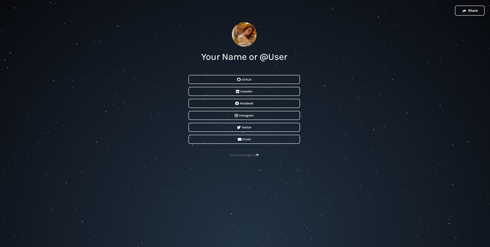

<h1 align="center">🏴‍☠️ Linknest </h1>
<h3 align="center">A simple static site to group all your social media profiles in one place.</h3>

<p align="center">
  
  
  <a href="https://devenprasad.ca">
    
  </a>
  
  
  
  <a href="https://paramedicspecialist.github.io/linkthing_enhanced/commits/master">
    
  </a>
</p>

<p align="center">
  <a href="#-about-the-project">About the project</a>&nbsp;&nbsp;&nbsp;|&nbsp;&nbsp;&nbsp;
  <a href="#-getting-started">Getting started</a>&nbsp;&nbsp;&nbsp;|&nbsp;&nbsp;&nbsp;
  <a href="#-how-to-contribute">How to contribute</a>&nbsp;&nbsp;&nbsp;|&nbsp;&nbsp;&nbsp;
  <a href="#-license">License</a>
</p>

---

<p align="center">
  
</p>

---

## 💡 About the project

Linknest is an open-source project that is forked from [/johnggli/linktree](https://github.com/johnggli/linktree), and serves as a free alternative to "linktree" type websites that can be hosted on "free" services such as GitHub Pages or Cloudflare Pages.
- [Demo (Hosted on GitHub Pages)](https://paramedicspecialist.github.io/linkthing_enhanced/)

## 🚀 Getting started

If you installed git you can clone the code to your machine, or download a ZIP of all the files directly.
[Download the ZIP from this location](https://github.com/paramedicspecialist/linkthing_enhanced/archive/master.zip), or run the following [git](https://git-scm.com/downloads) command to clone the files to your machine:
```bash
git clone https://github.com/paramedicspecialist/linkthing_enhanced/archive/master.zip
```
- Once the files are on your machine, open the _linktree_ folder in [Visual Studio Code](https://code.visualstudio.com/).
- With the files open in Visual Studio Code, press the **Go Live** button at the bottom of the window to launch the files with [Live Server](https://marketplace.visualstudio.com/items?itemName=ritwickdey.LiveServer).
- Change the profile image and texts in the `index.html` file.
- Change the colors and fonts in the `style.css` file.
- To change the background, go to the `style.css` file on line 17, uncomment the code snippet and change the url to whatever image you want.

## 🤔 How to contribute

- Fork this repository;
- Create a branch with your feature: `git checkout -b my-feature`;
- Commit your changes: `git commit -m "feat: my new feature"`;
- Push to your branch: `git push origin my-feature`.

Once your pull request has been merged, you can delete your branch.

## 📝 License

This project is under the MIT license. See the [LICENSE](LICENSE.md) file for more details.

---

Customized with 😈 by Deven Prasad 🚑 [About Me](https://devenprasad.ca)

Originally Made with ❤️ by John Emerson :wave: [Get in touch](https://johnggli.github.io/linktree)
